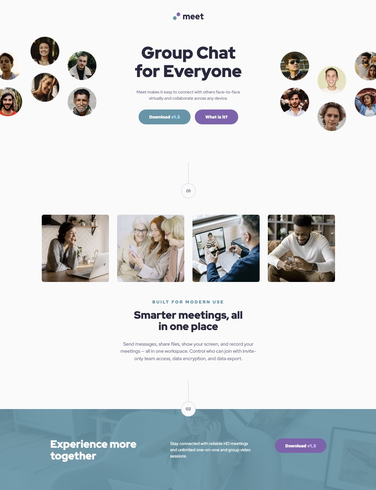

# Frontend Mentor - Meet landing page solution

This is a solution to the [Meet landing page challenge on Frontend Mentor](https://www.frontendmentor.io/challenges/meet-landing-page-rbTDS6OUR). Frontend Mentor challenges help you improve your coding skills by building realistic projects.

## Table of contents

- [Overview](#overview)
  - [The challenge](#the-challenge)
  - [Screenshot](#screenshot)
  - [Links](#links)
- [My process](#my-process)
  - [Built with](#built-with)
  - [What I learned](#what-i-learned)
  - [Useful resources](#useful-resources)
- [Author](#author)

## Overview

### The challenge

Users should be able to:

- View the optimal layout depending on their device's screen size
- See hover states for interactive elements

### Screenshot

### Links

- Solution URL: [Solution](https://github.com/vince4dev/challenge8)
- Live Site URL: [Live site](https://vince4dev.github.io/challenge8/)

## My process

### Built with

- Semantic HTML5 markup
- CSS custom properties
- Flexbox
- CSS Grid
- Mobile-first workflow

### What I learned

- While completing Challenge 8 on Frontend Mentor, I was able to significantly deepen my CSS Grid skills. I used the grid-area property to precisely place each element on the grid, which allowed me to improve the readability and maintainability of the code.

- At the same time, I optimized the CSS structure by introducing custom variables (--size-img-hero, --fw-black, etc.) in order to centralize reused values ​​and facilitate refactoring.

- Finally, I created two reusable components: a Button component (with style and state variations) and a Digit-Number component for the 2 digits present on the page. These improvements made the project more modular and scalable, while strengthening my understanding of advanced layout concepts.

### Useful resources

- [google-webfonts-helper](https://gwfh.mranftl.com/fonts) - This helped me find the font and integrate it into the project.
- [MDN](https://developer.mozilla.org/fr/) - Resources for Developers.

## Author

- Frontend Mentor - [@vince4dev](https://www.frontendmentor.io/profile/vince4dev)
